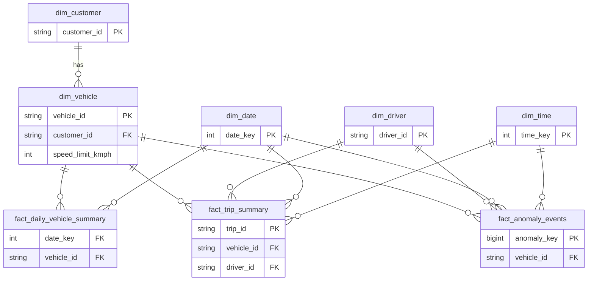

# Data Model & Design Brief — ExecuteWyse Fleet Analytics

## 1. Dimensional model (star schema)

Grain-first design: three fact tables at different grains share five conformed
dimensions. `dim_customer` snowflakes off `dim_vehicle` (a vehicle belongs to one
customer), so customer filters flow to every fact through the vehicle.



```
                          ┌──────────────┐
                          │ dim_customer │
                          └──────┬───────┘
                                 │ (snowflake)
        ┌──────────┐      ┌──────┴───────┐      ┌────────────┐
        │ dim_date │      │ dim_vehicle  │      │ dim_driver │
        └────┬─────┘      └──────┬───────┘      └─────┬──────┘
             │      ┌────────────┼─────────────┐      │
             ▼      ▼            ▼             ▼       ▼
   fact_daily_vehicle_summary  fact_trip_summary  fact_anomaly_events
             ▲                       ▲                 ▲
             └───────── dim_time ────┴─────────────────┘
```

### Dimensions

| Table | Grain | Key | Notes |
|-------|-------|-----|-------|
| `dim_vehicle` | one vehicle | `vehicle_id` | carries `vehicle_type`, `customer_id` (FK), and `speed_limit_kmph` (from vehicle type) |
| `dim_driver` | one driver | `driver_id` | + synthetic `UNKNOWN` member for unmatched telemetry drivers |
| `dim_customer` | one customer | `customer_id` | `customer_name`, `city`, `industry` |
| `dim_date` | one day | `date_key` (YYYYMMDD int) | day/month/year, day-of-week, weekend flag |
| `dim_time` | one minute of day | `time_key` (0–1439) | `hour`, `part_of_day` — powers hour-of-day heatmap |

### Fact tables

| Table | Grain | Key measures |
|-------|-------|--------------|
| `fact_daily_vehicle_summary` | vehicle × date | total_distance_km, running_hours, idle_hours, avg_speed, max_speed, trip_count, anomaly_count |
| `fact_trip_summary` | trip | actual_start/end, actual_distance_km, avg_speed, idle_time_mins, stoppage_count, running_hours, anomaly_count, planned vs actual |
| `fact_anomaly_events` | anomaly event | anomaly_type, severity, start/end_time, duration_secs, lat/long, metric_value, threshold_value |

Business (natural) keys are used directly as dimension keys — they are already
clean, unique, stable strings — so no surrogate-key lookup is needed. `date_key`
and `time_key` are the two integer smart-keys.

---

## 2. Data-quality handling

Every raw telemetry row is classified against all issues (they overlap), counts
are written to `dq_log`, then a single cleaning pass produces `clean_telemetry`.

Rejection reasons are applied in priority order so every rejected row is
attributed to exactly one reason and the counts reconcile
(1,669,427 − 42,828 = 1,626,599).

| Issue | Volume | Action | Rationale |
|-------|-------:|--------|-----------|
| Out-of-range date (2025-01-27) | 2,067 | **reject** | ~1.4h spill-over past the 7-day window; would skew per-day metrics & "Active Today" |
| Duplicate `event_id` | 24,612 | **reject** (keep earliest) | one physical event = one row |
| Invalid GPS (null/0/out-of-India) | 8,122 | **reject** | unusable coordinates; would corrupt distance & jump logic |
| Negative speed | 3,036 | **reject** | sensor error, no valid value to impute |
| Orphan vehicle (not in master) | 4,991 | **reject** | cannot attribute to the managed fleet |
| Orphan driver | 0* | **repair** → `UNKNOWN` | keep the vehicle event, flag driver unknown |
| Orphan trip | 700 | **repair** → `NULL` | treat as off-trip movement |
| Battery out of 0–100 | 72,360 | **repair** (clamp) | impossible % (values up to 104); clamped, row kept |
| NULL trip_id | 7,111 | **keep** | valid state — vehicle not on an active trip |

**Result: 1,669,427 → 1,626,599 rows (2.57% rejected).**
\*All orphan-driver rows were also orphan-vehicle rows, so they are removed by the
vehicle check first; none survive to need the UNKNOWN remap on this dataset.
Flags are NULL-safe (`COALESCE`) so a null sensor value can never make a row
vanish unlogged from both the reason buckets and `clean_telemetry`.

**Order of operations matters:** invalid GPS is removed *before* distance and
GPS-jump calculations, so teleports to (0,0) or out-of-bounds don't create
phantom jumps or inflate odometers.

---

## 3. Anomaly detection

All three use per-vehicle time-ordered telemetry and the same **gaps-and-islands**
technique to collapse contiguous flagged points into single events with a start,
end, and duration. A run is broken when an unflagged point intervenes **or** the
real-time gap between consecutive flagged points exceeds **120s** — so a vehicle
that is flagged, goes offline for hours, then returns flagged is not reported as
one giant event spanning the gap.

| Anomaly | Rule | Severity | Result |
|---------|------|----------|-------:|
| **Overspeeding** | speed > type limit (BIKE 60 / 3W 50 / LCV 80 / HCV 70). Consecutive over-limit points = one event | HIGH if peak >20% over, else MEDIUM | **109,550** (29,787 H / 79,763 M) |
| **Excessive idling** | ignition ON + speed 0 for >15 min continuously | LOW <30m / MED <1h / HIGH ≥1h | **0** (see below) |
| **GPS jump** | implied speed between two points >200 km/h | HIGH | **21,559** |

### Why zero idling *anomalies* — and why idling is still fully measured
The idling logic is implemented and correct; this dataset simply contains no
qualifying event. **Idling is still measured as a metric** (as the fact tables
require): `idle_hours` is populated for 1,659 vehicle-days (1,221 idle-hours
total) and `idle_time_mins` for 3,109 trips (~23 min avg). What has **zero
occurrences** is specifically the *>15-min continuous* idle **anomaly**:

- **Max continuous stopped duration = 3.3 min** (200s); 96% of stops resume at
  >30 km/h. The fleet is genuinely stop-and-go, never long-idling. Relaxing
  "stopped" from `=0` to `≤5 km/h` does not change this.
- Continuity **must** break on movement. If it didn't (time-gap-only merging),
  the longest "idle" block would be a **10.4-hour window that is 95% moving
  points at up to 98 km/h** — i.e. a full driving shift, not idle. Counting that
  as idling would be plainly wrong.

So rather than lower the threshold or drop the continuity rule to manufacture
events, the pipeline reports 0 and surfaces it in the run summary. The detection
will fire on any dataset that contains real continuous idling.

### GPS jumps are a data-quality signal, not driver behavior
A single bad in-bounds coordinate produces two >200 km/h transitions (one into
it, one out of it), so a naive per-transition count double-reports every glitch
(an early build showed 131k). Islanding collapses each burst into **one** event
(final: 21,559). GPS jumps reflect sensor/GPS quality, not driving, so the Power
BI **Safety Score** penalizes overspeeding (driver-controllable) and treats GPS
jumps as a separate data-quality category — see POWERBI_GUIDE.md.

*Nuance:* for the ~4% of jumps that straddle a device-offline gap, `duration_secs`
reflects that gap rather than an instantaneous teleport; the event **count** and
HIGH **severity** are unaffected (the rule is the literal ">200 km/h between two
points").

---

## 4. Key assumptions

1. **Distance (odometer)** = integrated from the **speed sensor** — trapezoidal
   `(speed + prev_speed)/2 × elapsed_time` per segment — not from GPS haversine.
   GPS positions scatter by tens of metres each sample; summed over a stationary
   vehicle that produces tens of km/day of phantom distance (early haversine
   builds showed 5,000+ km "trips"). Speed integration is immune to that. GPS
   coordinates are still used for the GPS-jump anomaly, where the jump *is* the
   signal.
2. **Distance & running/idle time count engine-on segments only** (`prev_ign =
   'ON'`), so the odometer and `running_hours` stay consistent (no "distance with
   zero running hours"). Gaps between points are **capped at 300s** so long
   offline periods aren't counted as engine-on time; attributed to the earlier
   point's day.
3. **Trip metrics use same-trip segments only.** A segment counts toward a trip
   only when both endpoints share its `trip_id`; otherwise the first point of
   each trip would fold in the (up to 300s) lead-in gap from the previous
   off-trip point, pushing `running_hours` past the trip's wall-clock duration.
4. **avg_speed** is the mean of *moving* points (speed > 0); `max_speed` is over
   all points. Reporting moving-average avoids near-zero speeds dragging the mean.
   Both fact tables use the same definition.
5. **Trip actuals** come from telemetry (min/max timestamp, summed distance), not
   the planned times in `trips.csv`. Only trips present in the master **and** with
   telemetry get a row (3,158 of 3,314; cancelled/no-signal trips excluded).
6. **7-day window (2025-01-20 → 26).** The source README states this range; a
   ~1.4h spill-over on 2025-01-27 (0.1% of rows) is dropped so per-day trends and
   the "Active Today" KPI aren't skewed by a partial stub day.
7. **`dim_time` at minute grain** (1440 rows) balances flexibility (exact minute)
   with a small dimension; hour-of-day analytics roll up via its `hour` column.
8. Timestamps are treated as provided (UTC per source README); no timezone shift.

---

## 5. Tradeoffs

| Decision | Chosen | Alternative | Why |
|----------|--------|-------------|-----|
| Engine | DuckDB | Postgres / Spark | Zero-setup, native Parquet, fast on 1.67M rows single-node; overkill avoided |
| Logic location | SQL modules | Pandas transforms | Set-based, readable, portable; window functions do islands cleanly |
| Keys | natural keys | surrogate keys | source keys already clean/unique/stable; simpler model |
| Idle threshold | strict (=0, ≤5 tested) | loose rolling window | honesty over manufactured anomalies |
| GPS jump grain | one event per glitch (islanded) | per raw transition | avoids double-counting each bad point (131k → 22k); still HIGH per rule |
| Odometer | speed integration, engine-on only | GPS haversine | GPS scatter inflated distance 30×; speed sensor is stable |
| Power BI feed | CSV/Parquet exports | live DuckDB ODBC | portable on macOS (no Windows ODBC needed); reproducible |

## 6. Possible extensions (not built, given scope)
- Incremental/partitioned loads by date for daily refresh instead of full rebuild.
- A `dim_geography` (reverse-geocode lat/long to city/zone) for spatial analysis.
- Trip planned-vs-actual variance facts (delay minutes, route deviation).
- Great-circle vs road-distance correction factor for more accurate km.
